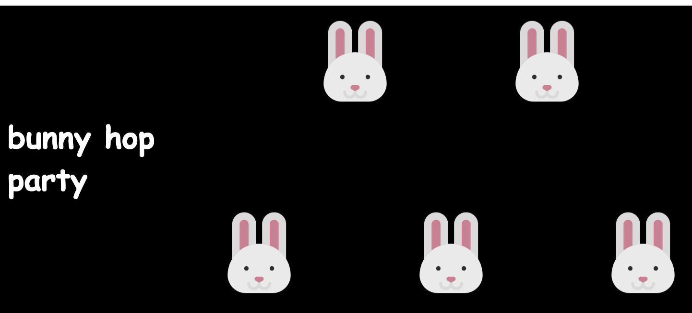
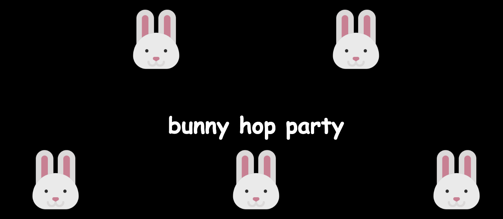
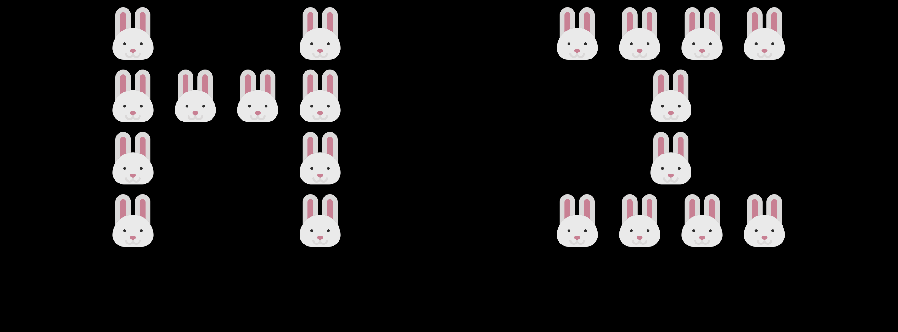

# Hackschool Session 4 Frontend: CSS Layout
**Location**: Boelter 5422 
**Time**: 6:00–7:00pm, October 30, 2019.

**Teacher**: Shirly Fang

## Resources

**Slides**
* [Session 4 Frontend: CSS Layout](https://docs.google.com/presentation/d/1mnEZAU6vqOJLqqinmmj3eAXhwUolTfS1a-rHZckr76k/edit?usp=sharing)

**ACM Membership Attendance Portal**
* [Portal](https://members.uclaacm.com/login)

## What we'll be learning today

* Flexbox

## The `display` property

Let's create a new directory on the desktop. In this document, we will call it
`hackschool-session-4-frontend`, but you can use any name of your choosing.

In this directory, let's first create a file called **`index.html`** with the
following content. This is to set up the project. 

```html
<!DOCTYPE html>
<html>
<head>
	<title>Bunnies</title>
	<link rel="stylesheet" href="style.css">
</head>
<body>
	<h1>bunny hop party</h1>
	<h1>hop hop hop</h1>
</body>
</html>
```

Then create a **`style.css`** file containing:

```css
html {
	height: 100%;
}

body {
	background-color: black;
	height: 100%;
}

h1 {
    color: white;
    font-family: 'Comic Sans MS';
}
```

When you open your html file in Google Chrome and inspect element, it should look like this. Notice that each element takes up the full width and the next element goes directly below the previous. 


This is what happens when the `display` property is set to `block`. By default most items are set to `display: block;`. CSS can be tricky since there are a lot of default values that you might not be aware of, which causes confusing layout problems.

Let's add some images:
```html
<html>
<head>
	<title>Bunnies</title>
	<link rel="stylesheet" href="style.css">
</head>
<body>
  <h1>bunny hop party</h1>
  <h1>bunny hop party</h1>
		
		
		
		
		
</body>
</html>
```

```css
img {
	height: 100px;
	width: 100px;
}
```

Notice that by default, the `img` tag has a `display` property of `inline-block`. So the bunnies will appear in a horizontal line. 


## Containers

If we want to center some items, the browser needs to know what element we're centering the items inside of. This element is called the container. In the DOM, elements are modeled as a tree with parent elements and child elements. The parent element is the container, and the child elements are the items.

Let's put our bunnies in a container:
```html
	<div class="bunny-container">
		
		
		
		
		
	</div>
```

I'm also going to add a border around the container element and make the height 300px.
```css
.bunny-container {
	border: solid 2px blue;
	height: 300px;
}
```

Now we can start using Flexbox!

## Flexbox

To turn a container into a flexbox, you set its `display` property to `flex`.
```css
.bunny-container {
	border: solid 2px blue;
	height: 300px;
	display: flex;
}
```

A flexbox has a main axis and a cross axis. By default, the main axis is horizontal. To change this, we set the `flex-direction` property to `column` on the container.
```css
.bunny-container {
	border: solid 2px blue;
	height: 300px;
	display: flex;
	flex-direction: column;
}
```

I'm going to set it back to row, so delete the `flex-direction: column;` line. 

One very useful property of flexbox is `justify-content`, which moves your items along the main axis. 

A similar property that moves your items along the cross axis is `align-items`.

```css
.bunny-container {
	height: 300px;
	display: flex;
	justify-content: space-around;
	align-items: center;
}
```

We can also set properties of the child flex items. For example, let's use the `align-self` property to put our bunnies in dance formation:

```css
img:nth-child(odd) {
	align-self: flex-end;
}
  
img:nth-child(even) {
	align-self: flex-start;
}
```

Here I'm selecting the image elements that fit the source code ordering criteria of either being an even-indexed element or odd-indexed element. Oddly ordered elements
will have the flex-end value while evenly ordered elements will have flex-start. This  :nth-child(val) selector is so I won't have to make new CSS rules and assign each image with class="new-style".

For a complete list of properties and their values, see [CSS-Tricks: A Guide to Flexbox](https://css-tricks.com/snippets/css/a-guide-to-flexbox/)

For a fun way to practice, see [Flexbox Froggy](http://flexboxfroggy.com/)


## Grid layout

A lot of websites use a grid for layout, saying how wide each element should be. 
To do this in flexbox, we can set the `flex` property of our child items. 

The goal of the next few steps is to have two bunny containers, one that is on the right half of the screen and one that is on the left half. 

To do this, I'm going to create a bunny-garden to act as a flex container and my bunny-container act as a flex item. It's important to note that you can nest flexboxes.

Add a second bunny-container and put both containers inside of the bunny-garden:
```html
<div class="bunny-garden">
	<div class="bunny-container">
		
		
		
		
		
	</div>
	<div class="bunny-container">
		
		
		
		
		
	</div>
</div>
```

Make the bunny-garden a flexbox:
```css
.bunny-garden {
	height: 100%;
	display: flex;
}
```

Use the `flex` property to set what percentage of the screen you want the width to be:
```css
.bunny-container {
	border: solid 2px blue;
	height: 300px;
	display: flex;
	justify-content: space-around;
	align-items: center;
	flex: 0 1 50%;
}
```

## Responsive web design

Responsive web design means that your website will look good even on different screen sizes (it "responds" to the screen size). 

With a grid layout, this might mean that a column that used to take 50% of a full desktop screen should now take 100% of a smaller screen.

To change styling based on the size of a screen, we can use something in CSS called a media query. In this media query, we're saying that when the screen width is less than 1000px, the bunny-container will start taking 100% of the width. 
```css
@media (max-width: 1000px) {
	.bunny-container {
		flex: 0 1 100%;
	}
}
```

Comment out the borders:
```css

.bunny-container {
	/* border: solid 2px blue; */
	height: 300px;
	display: flex;
	justify-content: space-around;
	align-items: center;
	flex: 0 1 50%;
}
```

The child items will be too big for their parent, but I still want them to wrap around on the screen. So I can set the `flex-wrap` property.
```css
.bunny-garden {
	height: 100%;
	display: flex;
	flex-wrap: wrap;
}
```

Now if you make your screen smaller, the bunnies won't disappear off the edge of the screen. 

## Making this a hop party

This section has nothing to do with flexbox, so you can skip it if you want. I just want to make this a real hop party.

I want to center my heading in my container. How would I do this? Let's try putting the `h1` element inside my container. 
```html
	<div class="bunny-container">
		<h1>bunny hop party</h1>
		
		
		
		
		
	</div>
```

The `h1` element is positioned relative to the bunnies, so it shows up next to them in a line just like any other flex item. 


To take the `h1` element out of the flow of its siblings, you set the `position` property to `absolute` (by default, `position` is set to `relative`).
```css
h1 {
	position: absolute;
	color: white;
	font-family: 'Comic Sans MS';
}
```

Since we centered everything earlier with flexbox, this is what it should look like:


To animate the bunnies:
```css
@keyframes jump {
	0%   {transform: translate3d(0,0,0) scale3d(1,1,1);}
	20%  {transform: translate3d(0,30%,0) scale3d(.7,1.5,1);}
	100% {transform: translate3d(0,100%,0) scale3d(1.5,.7,1);}
}

img {
	height: 100px;
	width: 100px;
	animation: jump 1s linear infinite;
}

```

Here I'm creating a jump animation that moves the bunny up and down.

Add another `h1` tag to the other bunny container and we're done!


## Mini project: A flex-boxy way to say hi 

Create a page that will use images to write capitalized letters. Make a new .html file and .css file. Remember flex-box properties such as justify-content, align-items, and flex-direction. Try to make as long of a phrase as possible! Here's an example with bunnies saying hi. 


